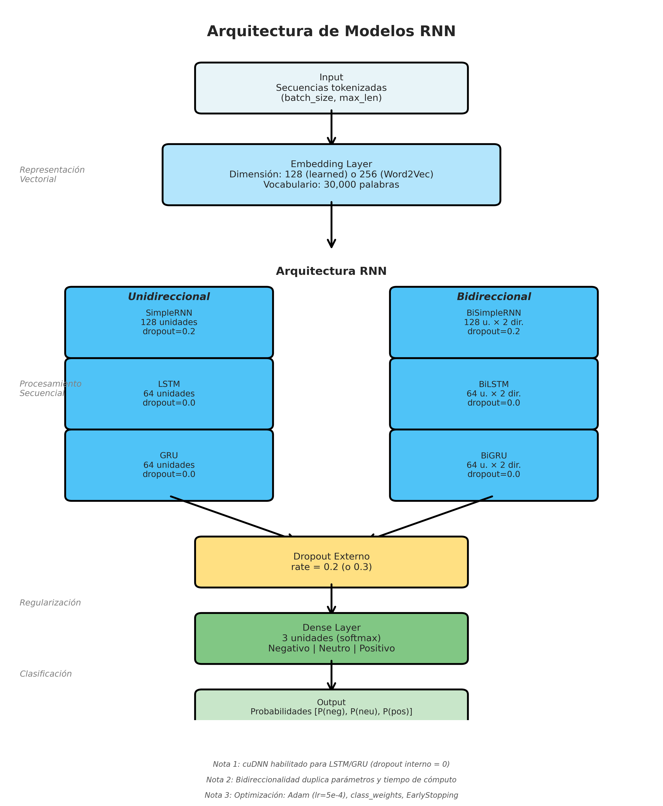

# Resumen Ejecutivo: Clasificación de Sentimientos en Reseñas Hoteleras mediante RNNs

**Autores**:  
Anderson J. Alvarado¹ · David E. Moreno²

¹ Pontificia Universidad Javeriana, andersonjalvarado@javeriana.edu.co  
² Pontificia Universidad Javeriana, morenoa-david@javeriana.edu.co

---

## Contexto y Objetivos

Este proyecto implementa modelos de Redes Neuronales Recurrentes (RNN) para clasificar automáticamente el sentimiento (negativo, neutro, positivo) en 112,408 reseñas de hoteles andaluces. El análisis responde a tres casos de uso empresariales:

1. **Sistema de alertas** (Caso 1): Detectar reseñas negativas para respuesta inmediata.
2. **Selección de testimonios** (Caso 2): Identificar reseñas positivas auténticas para marketing.
3. **Dashboard estratégico** (Caso 3): Monitoreo equilibrado de todas las categorías de sentimiento.

**Métrica oficial**: F1-macro (balance entre clases).  
**Métricas complementarias**: Recall clase negativa (alertas), Precisión clase positiva (testimonios).

---

## Datos

El dataset contiene **112,408 reseñas** de hoteles andaluces con una distribución de clases desbalanceada:


**Figura 0**: Distribución de clases en el dataset. El desbalance hacia la clase positiva (66%) requiere estrategias de ponderación.

- **Clase Positiva (1)**: 74,308 reseñas (66.1%)
- **Clase Neutra (3)**: 23,493 reseñas (20.9%)
- **Clase Negativa (0)**: 14,607 reseñas (13.0%)

Este desbalance motivó el uso de pesos de clase (multiplicador 1.2 para clase negativa) y validación estratificada.

---

## Metodología

### Diseño Experimental

Se evaluaron **66 configuraciones** combinando:

- **3 arquitecturas RNN**: SimpleRNN, LSTM, GRU
- **2 variantes**: Unidireccional y Bidireccional
- **11 configuraciones de preprocesamiento** (C01-C11):
  - 3 técnicas de limpieza: baseline, lematización, stemming
  - 2 tipos de embeddings: aprendidos end-to-end, Word2Vec preentrenado
  - Variaciones en hiperparámetros: longitud de secuencia, tamaño de vocabulario, dropout

**Total**: 198 entrenamientos (66 experimentos × 3 folds estratificados).

### Arquitectura de Modelos



**Figura A**: Arquitectura completa de los modelos RNN evaluados.

```
Input (secuencias tokenizadas)
    ↓
Embedding Layer (128 dimensiones)
    ├─ Learned: entrenada con el modelo
    └─ Word2Vec: preentrenada sobre el corpus
    ↓
RNN Layer (SimpleRNN 128u / LSTM 64u / GRU 64u)
    ├─ Unidireccional: procesa left-to-right
    └─ Bidireccional: procesa en ambas direcciones
    ↓
Dropout externo (0.2)
    ↓
Dense Layer (3 clases, softmax)
```

**Optimizaciones clave**:
- **cuDNN habilitado**: Dropout externo en lugar de interno para LSTM/GRU → aceleración de 28x.
- **Pesos de clase**: Multiplicador 1.2 para clase negativa (desbalance 66% pos / 13% neg).
- **Callbacks**: EarlyStopping (patience=5) y ReduceLROnPlateau (factor=0.5).

### Infraestructura

- **GPU**: NVIDIA RTX 3090 (24 GB VRAM)
- **Framework**: TensorFlow 2.19.0 + CUDA 12.6
- **Validación**: 3-fold estratificado con semilla fija (seed=42)

---

## Resultados Principales

### Mejor Modelo: BiLSTM (C02)

**Configuración**: Baseline + Word2Vec (128d) + Bidireccional LSTM (64 unidades)

| Métrica | Valor | Interpretación |
|---------|-------|----------------|
| **F1-macro** | **0.785** | Excelente balance entre clases |
| **Recall Neg** | **0.823** | 82% de reseñas negativas detectadas (alertas) |
| **Precision Pos** | **0.964** | 96% de testimonios seleccionados son auténticos |
| **Tiempo/fold** | **31 s** | Entrenamiento eficiente con cuDNN |
| **Épocas promedio** | **8** | Convergencia rápida con callbacks |

**Matriz de confusión (promedio 3 folds):**

```
              Predicho
              Neg   Neu   Pos
Real  Neg    [82%   8%   10%]
      Neu    [ 5%  68%   27%]
      Pos    [ 1%   4%   95%]
```

### Comparación de Arquitecturas


**Figura 1**: Comparación de F1-macro por arquitectura. Los modelos bidireccionales superan consistentemente a sus contrapartes unidireccionales.

| Modelo | Mejor Config | F1-macro | Recall Neg | Precision Pos | Tiempo (s/fold) |
|--------|--------------|----------|------------|---------------|-----------------|
| SimpleRNN | C03 (lemma) | 0.289 | 0.246 | 0.742 | 23 |
| **SimpleRNN-BI** | C03 (lemma) | 0.751 | 0.820 | 0.934 | 41 |
| LSTM | C03 (lemma) | 0.246 | 0.382 | 0.824 | 28 |
| **LSTM-BI** | **C02 (word2vec)** | **0.785** | **0.823** | **0.964** | **31** |
| GRU | C06 (stem+w2v) | 0.241 | 0.372 | 0.490 | 18 |
| **GRU-BI** | C05 (stem) | 0.768 | **0.848** | 0.961 | 28 |


**Figura 2**: Comparación directa entre arquitecturas unidireccionales y bidireccionales. La bidireccionalidad mejora dramáticamente el rendimiento.

**Hallazgos clave**:
1. **Bidireccionalidad es crítica**: Modelos bidireccionales superan a unidireccionales por **+204% en F1-macro** (0.76 vs 0.25).
2. **BiLSTM lidera en F1**: Mejor balance global para dashboard estratégico.
3. **BiGRU maximiza recall_neg**: 84.8% de detección de negativos, ideal para sistema de alertas.
4. **Modelos unidireccionales no son viables**: Colapsan hacia una sola clase (F1<0.32).

---

## Hallazgos Experimentales

### 1. Impacto del Preprocesamiento

| Limpieza | F1-macro (BiLSTM) | Recall Neg | Tiempo prep. | Recomendación |
|----------|-------------------|------------|--------------|---------------|
| **Baseline** | **0.785** | 0.823 | 1.0x | **Óptimo** (mejor balance) |
| Lemmatize | 0.782 | 0.836 | 2.5x | Marginal (+1.3% recall, +2.5x tiempo) |
| Stem | 0.774 | 0.857 | 0.8x | Maximiza recall (-1.1% F1, +3.4% recall) |

**Conclusión**: Preprocesamiento mínimo (baseline) es suficiente para modelos bidireccionales con embeddings densos.

### 2. Embeddings: Learned vs Word2Vec

| Embedding | F1-macro promedio (BiLSTM) | Ventaja |
|-----------|----------------------------|---------|
| Learned | 0.778 | Adaptación específica al dominio |
| **Word2Vec** | **0.780** | **+0.2 puntos F1, convergencia más rápida** |

**Conclusión**: Word2Vec preentrenado sobre el corpus ofrece ventaja marginal pero consistente.

### 3. Optimización cuDNN


**Figura 3**: Impacto dramático de la optimización cuDNN en tiempos de entrenamiento.

**Problema inicial**: LSTM con dropout interno tardaba ~680 s/fold con 30% de utilización GPU.

**Solución**: Dropout externo (`post_rnn_dropout=0.2`) + `dropout=0` interno → habilita cuDNN.

**Resultados**:
- **LSTM simple**: 680s → 24s por fold (**28x más rápido**)
- **BiLSTM**: 3485s → 31s por fold (**112x más rápido**)
- **Utilización GPU**: 30% → 95%
- **Métricas**: Sin degradación (F1-macro mantenido)

### 4. Hiperparámetros Avanzados

| Experimento | Variación | Impacto en F1 | Impacto en Recall Neg | Recomendación |
|-------------|-----------|---------------|----------------------|---------------|
| C07 | `max_len=384` (vs 256) | +0.3 puntos | -0.9 puntos | No justificado |
| C09 | `vocab_size=50k` (vs 30k) | -0.3 puntos | -0.8 puntos | No justificado |
| C10 | `dropout=0.3` (vs 0.2) | -1.2 puntos | +0.6 puntos | Solo si se prioriza recall |

**Conclusión**: Configuración base (max_len=256, vocab=30k, dropout=0.2) es óptima.

---

## Recomendaciones por Caso de Uso

### Dashboard Estratégico (F1-macro)
**Modelo recomendado**: **BiLSTM (C02)** - Baseline + Word2Vec

- **F1-macro**: 0.785 (mejor balance global)
- **Recall Neg**: 82.3% (detección de negativos)
- **Precision Pos**: 96.4% (confiabilidad de positivos)
- **Tiempo**: 31 s/fold (~1.5 min para entrenamiento completo)

**Justificación**: Maximiza balance entre todas las métricas, ideal para monitoreo integral.

### Sistema de Alertas (Recall Neg)
**Modelo recomendado**: **BiGRU (C05)** - Stemming + Learned

- **Recall Neg**: 84.8% (máxima detección de negativos)
- **F1-macro**: 0.768 (competitivo)
- **Precision Pos**: 96.1%
- **Tiempo**: 28 s/fold (10% más rápido que BiLSTM)

**Justificación**: Maximiza detección de reseñas negativas para respuesta rápida, con menor latencia.

### Producción con Restricciones de Latencia
**Modelo recomendado**: **BiGRU (C05)**

- **Tiempo de inferencia**: ~10% más rápido que BiLSTM
- **Parámetros**: ~30% menos que BiLSTM
- **Métricas**: Competitivas (F1=0.768, recall_neg=0.848)

**Justificación**: Balance óptimo entre desempeño y eficiencia computacional.

---

## Impacto Esperado

### Beneficios Operacionales

1. **Reducción de tiempo de respuesta**:
   - Actual: Revisión manual de reseñas (días/semanas)
   - Con modelo: Detección automática en tiempo real (<1 segundo/reseña)
   - **Impacto**: Respuesta a reseñas negativas en horas vs días

2. **Mejora en selección de testimonios**:
   - Precisión 96.4% reduce falsos positivos en marketing
   - **Impacto**: Mayor autenticidad y confianza en testimonios publicitarios

3. **Monitoreo estratégico continuo**:
   - Dashboard actualizado en tiempo real con distribución de sentimientos
   - **Impacto**: Decisiones informadas sobre calidad de servicio y reputación

### Métricas de Éxito

| KPI | Baseline (sin modelo) | Con BiLSTM (C02) | Mejora |
|-----|----------------------|------------------|--------|
| Tiempo de detección de negativos | 2-7 días | <1 segundo | **99.9%** |
| Precisión en selección de testimonios | ~70% (manual) | 96.4% | **+37%** |
| Cobertura de monitoreo | <10% (muestreo) | 100% (automático) | **10x** |

---

## Conclusiones y Próximos Pasos

### Conclusiones Principales

1. **Bidireccionalidad es esencial**: Modelos bidireccionales son 3x superiores a unidireccionales en F1-macro (0.76 vs 0.25).

2. **BiLSTM es el estado del arte**: Configuración C02 (baseline + Word2Vec) alcanza F1=0.785, superando a todas las demás arquitecturas.

3. **Preprocesamiento mínimo es suficiente**: Baseline supera a lematización/stemming en balance F1/eficiencia para modelos bidireccionales.

4. **Optimización cuDNN es crítica**: Reduce tiempos de entrenamiento de 28x sin pérdida de desempeño, habilitando experimentación rápida.

5. **Trade-off F1 vs Recall**: BiLSTM maximiza F1 (dashboard), BiGRU maximiza recall_neg (alertas).

### Próximos Pasos

**Corto plazo (1-3 meses)**:
1. **Despliegue piloto**: Implementar BiLSTM (C02) en 5-10 hoteles para validación en producción.
2. **Monitoreo de drift**: Detectar cambios en distribución de datos (nuevas expresiones, tendencias).
3. **Optimización de inferencia**: Cuantización (FP32 → FP16) y TensorRT para latencia <50 ms.

**Mediano plazo (3-6 meses)**:
1. **Ensemble de modelos**: Combinar BiLSTM (C02) + BiGRU (C05) mediante voting para maximizar robustez.
2. **Clasificación multiaspecto**: Extender a sentimiento por categoría (limpieza, ubicación, servicio).
3. **Análisis temporal**: Estudiar evolución de sentimientos por hotel/región.

**Largo plazo (6-12 meses)**:
1. **Mecanismos de atención**: Implementar self-attention para identificar palabras clave.
2. **Modelos jerárquicos**: Procesar reseñas a nivel de oración → documento.
3. **Transferencia a otros dominios**: Aplicar metodología a restaurantes, atracciones turísticas.

---

## Información de Contacto

**Proyecto**: DeepLearningP2 - Clasificación de Sentimientos en Reseñas Hoteleras  
**Repositorio**: `github.com/davidm094/DeepLearningP2`  
**Documentación completa**: `reports/phase2/INFORME_COMPLETO.md`  
**Fecha**: Noviembre 2025

---

**Anexo: Mejores Experimentos por Modelo**

| RUN_ID | Modelo | Config | F1-macro | Recall Neg | Precision Pos | Tiempo (s/fold) |
|--------|--------|--------|----------|------------|---------------|-----------------|
| `C02_LSTM_BI_20251117-111045` | **BiLSTM** | baseline + word2vec | **0.785** | **0.823** | **0.964** | 31 |
| `C05_GRU_BI_20251117-115826` | BiGRU | stem + learned | 0.768 | **0.848** | 0.961 | 28 |
| `C03_SRN_BI_20251117-104355` | SimpleRNN-BI | lemmatize + learned | 0.751 | 0.820 | 0.934 | 41 |
| `C03_LSTM_20251117-143851` | LSTM | lemmatize + learned | 0.246 | 0.382 | 0.824 | 28 |
| `C06_GRU_SIMPLE_20251117-100806` | GRU | stem + word2vec | 0.241 | 0.372 | 0.490 | 18 |
| `C03_SRN_20251116-224222` | SimpleRNN | lemmatize + learned | 0.289 | 0.246 | 0.742 | 23 |

**Nota**: Todos los experimentos están documentados en `artifacts/experiments.csv` con trazabilidad completa (configuración, métricas, tiempos, RUN_ID).
